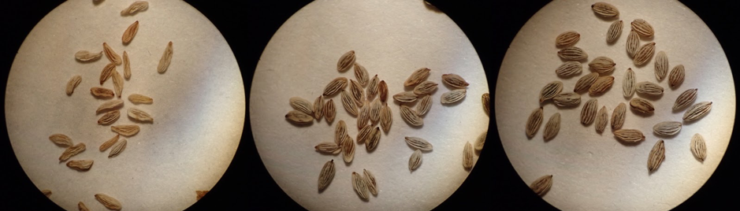
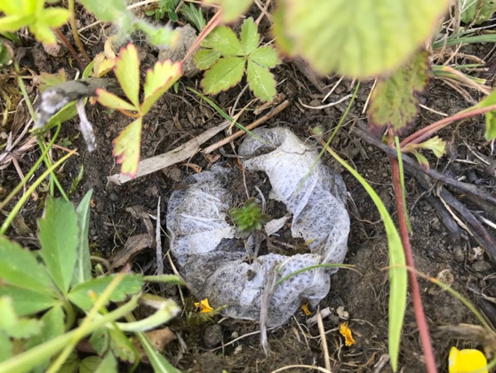

---
geometry:
    - top=3cm
    - bottom=4cm
    - left=2.5cm
    - right=2.5cm
include-before:
- '`\newpage{}`{=latex}'
---

\setcounter{page}{145}

# Appendices

## Appendix 1: Chapter 2

Figure 1: The distribution of ploidy levels across the British and Irish angiosperms in the four families with the highest number of species. Shown are Rosaceae, Poaceae, Asteraceae and Fabaceae. Each family has distinct distributions of ploidy levels.

{ width=100% }

\newpage{}

Table 1: Search strings for Google Scholar searches used to generate the list of examples of cross-ploidy hybrids in Chapter 2. Note that other examples were added if they were deemed to be important and/or well known.

Journal|Search string
|---|---|
Molecular Ecology|Ploidy hybrid genetic introgression diploid OR tetraploid OR hexaploidy OR octoploid source:”Molecular Ecology”
Evolution|Ploidy hybrid genetic introgression diploid OR tetraploid OR hexaploidy OR octoploid site:onlinelibrary.wiley.com source:”Evolution” -source:”and Evolution” -source:”Organic Evolution” 
Heredity|Ploidy hybrid genetic introgression diploid OR tetraploid OR hexaploidy OR octoploid source:”Heredity”
Annals of Botany|Ploidy hybrid genetic introgression diploid OR tetraploid OR hexaploidy OR octoploid source:”Annals of Botany”
American Journal of Botany|Ploidy hybrid genetic introgression diploid OR tetraploid OR hexaploidy OR octoploid source:” American Journal of Botany”
New Phytologist|Ploidy hybrid genetic introgression diploid OR tetraploid OR hexaploidy OR octoploid source:” New Phytologist”
PNAS|Ploidy hybrid genetic introgression diploid OR tetraploid OR hexaploidy OR octoploid source:” PNAS”
Biological Journal of the Linnean Society|Ploidy hybrid genetic introgression diploid OR tetraploid OR hexaploidy OR octoploid source:” Biological Journal of the Linnean Society”
Botanical Journal of the Linnean Society|Ploidy hybrid genetic introgression diploid OR tetraploid OR hexaploidy OR octoploid source:” Botanical Journal of the Linnean Society”
Journal of Evolutionary Biology|Ploidy hybrid genetic introgression diploid OR tetraploid OR hexaploidy OR octoploid source:” Journal of Evolutionary Biology”
PLoS One|Ploidy hybrid genetic introgression diploid OR tetraploid OR hexaploidy OR octoploid source:” PLoS One”

\newpage{}

## Appendix 2: Chapter 3

Figure 2: Trees with root nodes containing the highest and lowest posterior mean probability of hybridisation from Model 1 (BLUP’s of nodes in the phylogeny). A is the top tree (subset of Orchidaceae) whilst B is the tree with lowest probability of hybridisation (Fabaceae and Polygalaceae).

{ width=100% }

\newpage{}

Figure 3: The joint probability of hybridisation between two parental species give both branch length between species (tree based genetic distance) and geographical overlap between parental species (measured as overlap in occupancy of 10x10km grid squares in the UK). The degree of shading in the scale bar and tiles represent the posterior probability of hybridisation from Model 1 given parameter values for each variable. Estimates are visualised at mean genus size, for annual-perennial parental combinations and accounting for phylogenetic relationships between species.

{ width=100% }

\newpage{}

Figure 4: Predicted fit of probability of hybridisation given hectad sharing and ploidy difference of parental species from Model 2. Dashed lines indicate the 95% Credible Intervals, and the bold lines represent the posterior mode of the coefficients of congeneric pairs of species hybridising as a function of pairwise overlap in distribution, conditional on parental ploidy status. The effect is visualised at mean genetic distance for annual-perennial parent combinations and accounting for phylogenetic effects. The bold red dashed line indicates mean pairwise overlap in distribution (10x10km^2^).

{ width=100% }

\newpage{}

Figure 5: Predicted fit of probability of hybridisation given branch length between parental species  and ploidy difference of parental species from Model 2. Homoploid indicates parental species of the same ploidy level, and heteroploidy indicates parental species of different ploidy levels. Dashed lines indicate the 95% Credible Intervals, and the bold lines represent the posterior mode of the coefficients of congeneric pairs of species hybridising as a function of pairwise branch length, conditional on parental ploidy status. The effect is visualised at mean hectad sharing for annual-perennial parent combinations and accounting for phylogenetic effects. The red dashed line indicates mean pairwise branch length between all pairs of species.

{ width=100% }

\newpage{}

Figure 6: Predicted fit of probability of hybridisation given branch length between parental species from Model 1. Black dashed lines are the 95% Credible Intervals, bold line is the posterior mean of the coefficient for the probability of congeneric pairs of species hybridising as a function of branch length. This effect is visualised at mean hectad sharing, for annual-perennial parent combinations and accounting for phylogenetic effects. The bold red dashed line indicates mean genus level genetic distance between pairs of species.

{ width=100% }

\newpage{}

\blscape
Table 2: Model 1: Probability of hybridisation on the probit scale with genetic distance, hectads shared and life history of parental species as fixed covariates. The posterior mean of the distribution of each coefficient is given, along with lower and upper 95% Credible Intervals. The p-value (pMCMC) is also reported and given in bold where significant. Annual-perennial and perennial-perennial levels are jointly tested using a Wald test in the main text.

Covariate|Posterior mean|l-95% CI|u-95% CI|Effective sample size|pMCMC
|---|---|---|---|---|---|
(Intercept)|-1.31|-3.76|0.60|1000|0.22
Branch length between species pairs|-59.75|-66.69|-51.98|185.41|0.0010
Hectads shared between species pairs|0.001|0.0007|0.0012|1000|0.0010
Annual-perennial parent pair|-0.12|-0.97|0.66|1000|0.76
Perennial-perennial parent pair|0.64|-0.25|1.58|1000|0.16
Genus size|-0.0014|-0.041|0.031|1107|0.92

Table 3: Phylogenetic signal of probability of hybridisation and the species variance independent of phylogenetic effects on the probit scale. 95% Credible Intervals of the variances are also presented. See Methods in Chapter 3 for calculation.

Variance Component|Posterior Mode|Lower Credible Interval|Upper Credible Interval
|------|---|---|---|
Model 1 Phylogenetic Variance|0.62|0.32|0.77
Model 1 Species Variance|0.33|0.18|0.58
Model 2 Phylogenetic Variance|0.61|0.30|0.82
Model 2 Species Variance|0.34|0.084|0.44
\elscape

\newpage{}

\blscape
Table 4: Model 2: Probability of hybridisation on the probit scale with ploidy, genetic distance, hectads shared and life history of parental species as covariates. The posterior mean of the distribution of each coefficient is given, along with lower and upper 95% Credible Intervals. The p-value (pMCMC) is also reported and given in bold where significant. 

Covariate|Posterior mean|l-95% CI|u-95% CI|Effective sample size|pMCMC
|---|---|---|---|---|---|
(Intercept)|-0.11|-2.41|2.12|813|0.93
Branch length between species pairs|-74.93|-88.38|-63.46|319|0.0010
Crosss ploidy effect|-0.73|-1.02|-0.40|1000|0.0010
Hectads shared between species pairs|0.0013|0.0009|0.0016|883|0.0010
Annual-perennial parent pair|0.093|-1.15|1.23|836|0.89
Perennial-perennial parent pair|0.82|-0.40|1.96|836|0.16
Genus size|-0.029|-0.084|0.031|621|0.32
\elscape
\newpage{}

## Appendix 3: Chapter 4

Figure 7: Distributions of parameters fitted to the models with constant gene flow (blue), secondary contact (green), and without gene flow (grey) in the demographic simulation software, $\delta{a}\delta{I}$. The model with historic gene flow (orange) had poor AIC values, and so is omitted here.

{ width=100% }

\newpage{}

\blscape
Table 5: Primers and PCR conditions used to amplify the *rpL32*-*trnL*~UAG~ plastid marker in *Euphrasia* species.

Primer|Orientation|Sequence (5’-3’)|||Reagents (1 reaction)|PCR conditions|References
|---|---|---|---|---|---|---|---|
*rpL32*-F|Forward|CAGTTCCAAAAAAACGTACTTC|||12.5$\mu$M Taq 2X Master Mix, 0.5$\mu$L Bovine Serum Albumen, 0.5$\mu$L forward and reverse primers at 10$\mu$M, 10.5$\mu$L water, 1$\mu$L sample DNA|5 min at 94$^{\circ}$C, 35× (30 s at 94$^{\circ}$C, 45 s at 50$^{\circ}$C, 40 s at 72$^{\circ}$C), 5 min at 72$^{\circ}$C|(Wang et al., 2018)
*trnL*~UAG~|Reverse|CTGCTTCCTAAGAGCAGCGT|-||
\elscape

\newpage{}

\blscape
Table 6: Primers and PCR conditions used to amplify the ITS1 nuclear marker in *Euphrasia* species.

Primer|Orientation|Sequence (5’-3’)|||Reagents (1 reaction)|PCR conditions|References
|---|---|---|---|---|---|---|---|
ITS4|Forward|TCCTCCGCTTATTGATATGC|||12.5$\mu$M Taq 2X Master Mix, 0.5$\mu$L Bovine Serum Albumen, 0.5$\mu$L forward and reverse primers at 10$\mu$M, 10.5$\mu$L water, 1$\mu$L sample DNA|5min at 94$^{\circ}$C, 30 x (30s at 94$^{\circ}$C, 30s at 54$^{\circ}$C, 2min at 72$^{\circ}$C), 10 min at 72$^{\circ}$C.|(Wang et al., 2018)
ITS5|Reverse|GGAAGTAAAAGTCGTAACAAGG|-||
\elscape

\newpage{}

\blscape
## Appendix 4: Chapter 6

Table 7: Host species used in the common garden experiment in Chapter 6. The species along with the taxonomic family they belong to, their ecological functional group and the source of the seeds are also given. Commercial seed stocks list the original collection where known.

Common name|Species name|Family|Functional group (informal)|Seed source
|---|---|---|---|---|
Thale cress|*Arabidopsis thaliana*|Brassicaceae|Herb|Laboratory stock
Field horsetail|*Equisetum arvense*|Equisetaceae|Fern|Wild collected in Edinburgh (GPS coordinates: 55.9679, -3.2129)
Red fescue|*Festuca rubra*|Poaceae|Grass|Commerical: Emorsgate seeds (Yorkshire + Dorset)
Yorkshire fog|*Holcus lanatus*|Poaceae|Grass|Commerical: Emorsgate seeds
Common liverwort|*Marchantia polymorpha*|Marchantiaceae|Bryophyte|Wild collected in Edinburgh (GPS coordinates: 55.9679, -3.2129)
Ribwort plantain|*Plantago lanceolata*|Plantaginaceae|Herb|Commerical: Emorsgate seeds (Somerset + Wiltshire)
Scots pine|*Pinus sylvestris*|Pinaceae|Tree|Commerical: Scotia Seeds
White clover|*Trifolium repens*|Fabaceae|Herb|Commerical: Emorsgate seeds (Yorkshire + Wiltshire)
\elscape

\newpage{}

\blscape
Table 8: Collection details for *Euphrasia* species used in the common garden experiment. \*Population also used in the multiple host phenotypic plasticity experiment.

Collection number|Taxon|Locality|Latitude|Longitude|Collector
|---|---|---|---|---|---|
E4E0138|*E. arctica*|Fintallick, Glen Ledock, Comrie, Perthshire|56.41318|–4.03085|Dot Hall
E4E0144|*E. arctica*|Balachuirn, Isle of Raasay|57.38996|–6.06877|S.J. Bungard
E4E0032|*E. arctica*|South Links, Burray, Orkney|58.85275|–2.88701|John Crossley
E4E0139|*E. arctica*|Dalreoch Farm, Enochdhu|56.74199|–3.53350|Martin Robinson
E4E0049|*E. arctica*|Ouaisne, Jersey|49.17707|–2.18293|Anne Haden
E4E0247|*E. arctica*|Elsdon. Newcastle upon Tyne|55.22770|–2.10234|Stephanie Miles
NBer001\*|*E. arctica*|North Berwick Glenn, East Lothian|56.05696|–2.70456|Alex Twyford
E4E0038|*E. confusa*|Oldbury, near Hartshill, Warwickshire|52.55285|–1.53980|John and Monika Walton
E4E0114|*E. confusa*|Trethew Mill, Bodmin, Cornwall	50.39585|–4.709558|Rosemary Parslow
E4E0095|*E. confusa*|North Anston Grassland, South Yorkshire|53.34738|–1.20803|Graeme Coles
E4E0009|*E. confusa*|Devil’s Hole Blowout, Ravenmeols Local Nature Reserve, Merseyside|53.54062|–3.09041|Philip H. Smith
E4E0188|*E. micrantha*|Meall a Bathaich, Glen Garry, East Perthshire|56.82082|–4.182812|Alistair Godfrey
E4E0064|*E. nemorosa*|Castle Hill Local Nature Reserve, East Sussex|50.7842|0.052719|David Harris
E4E0069|*E. nemorosa*|Meridian Business Park, Leicester|52.60857|–1.19809|Geoffrey Hall
E4E0123|*E. nemorosa*|Bloody Oaks Triangle, Tickercote, Rutland|52.68950|–0.56263|Geoffrey Hall
E4E0029|*E. pseudokerneri*|Levin Down, Sussex|50.91346|–0.74150|Elizabeth Sturt
E4E0112|*E. pseudokerneri*|Beeston Common, Norfolk|52.93442|1.220071|Francis Farrow
E4E0027|*E. anglica* x *E. nemorosa*|West Dean Woods, Sussex|50.93212|–0.79735|Elizabeth Sturt
E4E0016|*E. anglica* x *E. rostkoviana*|Straduff Rathcabbin, Co. Tipperary|53.11902|–8.02454|David Nash
E4E0033|*E. arctica* x *E. confusa*|Nr Quoyorally, South Ronaldsay, Orkney|58.75897|–2.93473|John Crossley
E4E0145|*E. arctica* x *E. nemorosa*|Kylfakin, Wof, Skye|57.26685|–5.76042|S.J. Bungard
E4E0021|*E. arctica* x *E. nemorosa*|Dunamase, Co. Laois|53.03153|–7.21015|David Nash
E4E0031|*E. nemorosa* x *E. confusa*|Dolebury Fort, Somerset|51.32605|–2.79432|C.W. Hurfurt
E4E0143|*E. tetraquetra* x *E. confusa*|Ballyteige Burrow, Co Wexford, Ireland|52.20268|–6.64325|Jim Hurley
\elscape

\newpage{}

\blscape
Table 9: Summary of trait values for many *Euphrasia* species and hybrids grown on a clover host (i.e. the species differences experiment). Values are means ±1 SE.  Length measurements are in millimeters. Note: Date of first flower not recorded.

Taxon|Corolla length|Height|Internode ratio|Julian days to flower|Lower floral leaf teeth|Nodes to flower|Number of branches
|---|---|---|---|---|---|---|---|
*E. arctica*|8.0 ± 0.2|82.9 ± 4.4|1.1 ± 0.1|195.2 ± 1.5|4.4 ± 0.1|8.6 ± 0.2|*4.56 ± 0.2
*E. confusa*|6.9 ± 0.2|134.4 ± 7.2|1.6 ± 0.1|200.2 ± 2.4|5.3 ± 0.2|11.1 ± 0.4|7.26 ± 0.5
*E. micrantha*|5.6 ± 0.2|70.6 ± 8.1|3.0 ± 0.4|—|2.4 ± 0.3|8.3 ± 0.2|0.57 ± 0.4
*E. nemorosa*|7.7 ± 0.1|127.4 ± 8.1|1.4 ± 0.1|206.6 ± 1.7|5.1 ± 0.2|11.9 ± 0.5|7.67 ± 0.5
*E. pseudokerneri*|8.8 ± 0.4|176.4 ± 15.6|1.4 ± 0.1|205.1 ± 2.0|5.5 ± 0.2|13.2 ± 0.4|8.67 ± 0.6
*E. anglica* x *E. nemorosa*|9.1 ± 0.5|148.1 ± 11.8|1.4 ± 0.1|195.7 ± 1.9|6.0 ± 0.3|12.0 ± 0.6|10.00 ± 1.0
*E. anglica* x *E. rostkoviana*|7.9 ± 0.2|122.6 ± 8.3|1.3 ± 0.1|192.3 ± 12.3|5.9 ± 0.3|10.6 ± 0.5|7.44 ± 0.7
*E. arctica* x *E. confusa*|9.5 ± 0.2|100.3 ± 4.3|1.4 ± 0.1|193.4 ± 3.2|3.8 ± 0.1|7.8 ± 0.3|5.70 ± 0.4
*E. arctica* x *E. nemorosa*|8.0 ± 0.2|132.2 ± 14.5|1.3 ± 0.1|205.3 ± 2.4|6.0 ± 0.3|11.3 ± 0.4|6.50 ± 0.4
*E. arctica* x *E. nemorosa*|7.9 ± 0.2|92.5 ± 5.9|1.0 ± 0.1|199.3 ± 2.8|5.1 ± 0.2|9.8 ± 0.3|7.00 ± 0.5
*E. confusa* x *E. tetraquetra*|7.2 ± 0.2|57.4 ± 5.8|0.7 ± 0.1|194.1 ± 2.7|4.2 ± 0.2|7.6 ± 0.4|4.00 ± 0.3
\elscape

\newpage{}

Figure 8: Principal component analysis of morphological variation of *Euphrasia* in a common garden. Panels show (A) five species and six hybrids grown with a single clover host, (B) five species grown with a clover host omitting hybrids, and (C) *E. arctica* with nine host treatments. Points represent individuals, and ellipses represent the standard error of the (weighted) average of scores.

{ width=100% }

\newpage{}

Table(s) 10: The first five principal components extracted from the principal component analysis, with the contribution of variance of each trait to each principal component. The last two rows of each table show the standard deviation and the proportion of variance explained by the principal component.

Species differences (including hybrids)|PC1|PC2|PC3|PC4|PC5
|---|---|---|---|---|---|
Branches|0.229|0.053|0.071|0.252|0.094
Corolla length|0.089|0.262|0.369|0.032|0.136
Height|0.211|0.115|0.149|0.047|0.379
Internode ratio|0.005|0.441|0.186|0.030|0.190
Leaf teeth|0.213|0.056|0.097|0.428|0.128
Nodes to flower|0.224|0.093|0.126|0.181|0.081
Standard deviation|1.738|1.099|0.964|0.616|0.533
Proportion of variance|0.503|0.201|0.155|0.063|0.047

Species differences (excluding hybrids)|PC1|PC2|PC3|PC4|PC5
|---|---|---|---|---|---|
Branches|0.226|0.024|0.096|0.233|0.017
Corolla length|0.100|0.269|0.361|0.082|0.141
Height|0.214|0.128|0.151|0.063|0.367
Internode ratio|0.029|0.434|0.202|0.000|0.171
Leaf teeth|0.214|0.032|0.064|0.424|0.159
Nodes to flower|0.217|0.113|0.125|0.198|0.145
Standard deviation|1.780|1.111|0.932|0.612|0.433
Proportion of variance|0.528|0.206|0.145|0.062|0.031

Phenotypic plasticity|PC1|PC2|PC3|PC4|PC5
|---|---|---|---|---|---|
Branches|0.183|0.065|0.032|0.098|0.220
Corolla length|0.139|0.001|0.252|0.340|0.030
Height|0.179|0.150|0.016|0.065|0.128
Internode ratio|0.070|0.301|0.274|0.119|0.146
Julian days to flower|0.158|0.198|0.056|0.077|0.191
Leaf teeth|0.178|0.024|0.090|0.153|0.166
Nodes to flower|0.093|0.262|0.280|0.147|0.119
Standard deviation|1.904|1.137|0.924|0.725|0.586
Proportion of variance|0.518|0.185|0.122|0.075|0.049

\newpage{}

\blscape
Figure 9: Pairwise differences in trait value of *Euphrasia* species grown with clover in a common garden experiment. Tukey comparisons are presented between each pair of species, with significant comparisons shown in bold. Point estimates are the mean difference of the comparison, and error bars are +/- one standard error, calculated from the species differences model using the emmeans R package. \*\*\* p < 0.001, \*\* p < 0.01, \* p < 0.05.

\elscape

\newpage{}

\blscape
Table 11: Summary of trait values for *Euphrasia arctica* grown on many different hosts. Values are mean +/- one standard error.  Length and height measurements are in millimeters.

Early season|At first flowering|||||||End of season
|---------|-----|-----|-----|-----|-----|-----|-----|-----|-----|
Host|Height|Corolla length|Height|Internode ratio|Julian days to flower|Lower floral leaf teeth|Nodes to flower|Number of branches|Height
*A. thaliana*|12.8 ± 1.1|6.1 ± 0.3|19.2 ± 1.6|2.4 ± 0.1|201.6 ± 4.3|3.2 ± 0.1|8.8 ± 0.3|2.1 ± 0.4|30.0 ± 3.2
*E. arvense*|6.1 ± 0.4|5.9 ± 0.3|15.1 ± 1.1|2.6 ± 0.2|215.3 ± 4.6|2.4 ± 0.1|9.3 ± 0.3|0.4 ± 0.1|35.6 ± 4.8
*F. rubra*|6.7 ± 0.4|6.3 ± 0.1|19.5 ± 1.4|2.6 ± 0.2|216.5 ± 4.4|2.8 ± 0.2|9.6 ± 0.3|0.8 ± 0.3|39.6 ± 4.1
*H. lanatus*|7.1 ± 1.3|6.3 ± 0.1|16.0 ± 1.6|2.4 ± 0.2|224.5 ± 7.0|2.5 ± 0.2|9.8 ± 0.4|0.8 ± 0.4|33.8 ± 6.8
*M. polymorpha*|6.3 ± 0.7|5.5 ± 0.4|9.6 ± 1.3|2.9 ± 0.4|222.6 ± 17.0|1.7 ± 0.3|9.7 ± 0.5|0|11.3 ± 2.5
No host|5.9 ± 0.3|5.3 ± 0.2|11.2 ± 1.1|2.8 ± 0.2|241.3 ± 7.9|1.9 ± 0.3|9.9 ± 0.5|0|9.7 ± 2.0
*P. lanceolata*|7.5 ± 0.5|6.1 ± 0.1|14.1 ± 0.8|2.8 ± 0.1|211.2 ± 3.7|2.9 ± 0.1|10.4 ± 0.3|0.4 ± 0.1|28.3 ± 3.4
*P. sylvestris*|6.2 ± 0.6|5.7 ± 0.3|12.2 ± 1.3|2.9 ± 0.2|233.8 ± 6.1|1.9 ± 0.2|9.2 ± 0.3|0|17.2 ± 2.6
*T. repens*|12.9 ± 1.4|7.4 ± 0.2|39.4 ± 2.6|2.1 ± 0.2|189.8 ± 2.0|3.9 ± 0.1|8.7 ± 0.3|4.7 ± 0.4|143.2 ± 8.6
\elscape
\newpage{}

\blscape
Table 12: Comparison of *E. arctica* traits in the phenotypic plasticity common garden experiment. Tukey comparisons are presented between *E. arctica* traits with two different host treatments. Point estimates are the mean difference of the comparison, calculated from the phenotypic plasticity model using the emmeans R package. \*\*\* p < 0.001, \*\* p < 0.01, \* p < 0.05.

|Host 1|Host 2|Corolla length|Height|Internode ratio|Julian days to flower|Nodes to flower|Number of leaf teeth|
|------|------|---|---|---|---|---|---|
|*Arabidopsis thaliana*|No host|1.065\*|0.49\*|0.102|-0.178\*\*\*|-0.116|0.508|
|*Equisetum arvense*|No host|0.946\*|0.304|0.041|-0.112\*\*\*|-0.066|0.212|
|*Festuca rubra*|No host|1.04\*|0.529\*\*|0.073|-0.112\*\*\*|-0.034|0.397|
|*Holcus lanatus*|No host|1.05\*|0.332|0.077|-0.063|-0.009|0.258|
|*Marchantia polymorpha*|No host|0.25|-0.181|0.07|-0.031|-0.025|-0.136|
|*Pinus sylvestris*|No host|0.481|0.067|0.015|-0.03|0.051|0.01|
|*Plantago lanceolata*|No host|0.879|0.246|0.016|-0.137\*\*\*|-0.071|0.419|
|*Trifolium repens*|No host|2.102\*\*\*|1.241\*\*\*|0.180\*|-0.244\*\*\*|-0.134|0.711|
|*Equisetum arvense*|*Arabidopsis thaliana*|-0.119|-0.186|-0.061|0.066\*|0.05|-0.296|
|*Festuca rubra*|*Arabidopsis thaliana*|-0.024|0.039|-0.029|0.065\*\*|0.082|-0.111|
|*Holcus lanatus*|*Arabidopsis thaliana*|-0.015|-0.158|-0.025|0.114\*\*\*|0.107|-0.25|
|*Marchantia polymorpha*|*Arabidopsis thaliana*|-0.815|-0.671\*\*\*|-0.032|0.147\*\*\*|0.091|-0.644|
|*Pinus sylvestris*|*Arabidopsis thaliana*|-0.584|-0.423\*|-0.087|0.148\*\*\*|0.167|-0.498|
|*Plantago lanceolata*|*Arabidopsis thaliana*|-0.186|-0.244|-0.086|0.041|0.044|-0.089|
|*Trifolium repens*|*Arabidopsis thaliana*|1.037\*\*\*|0.751\*\*\*|0.077|-0.066|-0.018|0.204|
|*Festuca rubra*|*Equisetum arvense*|0.095|0.225|0.031|0|0.032|0.185|
|*Holcus lanatus*|*Equisetum arvense*|0.104|0.028|0.035|0.049|0.057|0.046|
|*Marchantia polymorpha*|*Equisetum arvense*|-0.696|-0.486\*|0.029|0.081|0.041|-0.348|
|*Pinus sylvestris*|*Equisetum arvense*|-0.465|-0.237|-0.025|0.082\*\*|0.117|-0.202|
|*Plantago lanceolata*|*Equisetum arvense*|-0.067|-0.059|-0.024|-0.025|-0.006|0.207|
|*Trifolium repens*|*Equisetum arvense*|1.156\*\*\*|0.937\*\*\*|0.138\*|-0.132\*\*\*|-0.068|0.499*|
|*Holcus lanatus*|*Festuca rubra*|0.01|-0.197|0.003|0.049|0.025|-0.139|
|*Marchantia polymorpha*|*Festuca rubra*|-0.79|-0.71\*\*\*|-0.002|0.081|0.009|-0.533|
|*Pinus sylvestris*|*Festuca rubra*|-0.56|-0.462\*\*|-0.057|0.083\*\*|0.085|-0.387|
|*Plantago lanceolata*|*Festuca rubra*|-0.161|-0.283|-0.056|-0.025|-0.038|0.022|
|*Trifolium repens*|*Festuca rubra*|1.062\*\*\*|0.712\*\*\*|0.106|-0.132\*\*\*|-0.1|0.315|
|*Marchantia polymorpha*|*Holcus lanatus*|-0.8|-0.513\*|-0.006|0.033|-0.016|-0.394|
|*Pinus sylvestris*|*Holcus lanatus*|-0.569|-0.265|-0.061|0.034|0.06|-0.248|
|*Plantago lanceolata*|*Holcus lanatus*|-0.171|-0.086|-0.06|-0.074\*\*|-0.063|0.161|
|*Trifolium repens*|*Holcus lanatus*|1.052\*\*|0.909\*\*\*|0.102|-0.18\*\*\*|-0.125|0.454|
|*Pinus sylvestris*|*Marchantia polymorpha*|0.231|0.248|-0.055|0.001|0.076|0.146|
|*Plantago lanceolata*|*Marchantia polymorpha*|0.629|0.427|-0.054|-0.106\*\*\*|-0.047|0.555|
|*Trifolium repens*|*Marchantia polymorpha*|1.852\*\*\*|1.423\*\*\*|0.109|-0.213\*\*\*|-0.109|0.847\*|
|*Plantago lanceolata*|*Pinus sylvestris*|0.398|0.178|0.001|-0.107\*\*\*|-0.123|0.409|
|*Trifolium repens*|*Pinus sylvestris*|1.621\*\*\*|1.174\*\*\*|0.164\*|-0.214\*\*\*|-0.185|0.701\*|
|*Trifolium repens*|*Plantago lanceolata*|1.223\*\*\*|0.996\*\*\*|0.163\*|-0.107\*\*\*|-0.063|0.292|
\elscape

\newpage{}

Table 13: Analysis of deviance for each trait in the phenotypic plasticity experiment with *E. arctica* grown with many different hosts, assuming a Poisson distribution. For each model, we report the change in degrees of freedom (df), deviance, residual degrees of freedom, residual deviance, and p-value generated from the $\chi^{2}$ distribution. Factor host, where the model includes all host species, is compared to the intercept model where no hosts are fitted.

Trait|Factor|df|Deviance|Resid. df|Resid. Dev|Pr(> $\chi^{2}$ )|
|---|---|---|---|---|---|---|
|Julian days to flower|Host|8|192.390|184|419.1153|2.56E-37|
||(Intercept)||192|611.5053||
|Nodes to flower|Host|8|5.020|185|38.47252|0.755416|
||(Intercept)||193|43.49272||	
|Number of leaf teeth|Host|8|26.793|185|41.37748|0.000767
||(Intercept)||193|68.17096||

Table 14: ANOVAs for traits measured in the phenotypic plasticity experiment with *E. arctica* grown with many different hosts, assuming Gaussian distributed residuals. For each model, we report the degrees of freedom (df), sums of squares (SS), mean squares (MS), F-statistic, and p-value.

Trait|Factor|df|SS|MS|F|p
|---|---|---|---|---|---|---|
Corolla length|Host|8|49.469|6.184|9.854565|3.00E-11
||Residuals|173|108.555|0.6275||		
Height|Host|8|27.021|3.378|23.139|2.52E-24
||Residuals|185|27.009|0.146||		
Internode ratio|Host|8|0.562|0.070|3.362213|0.001275
||Residuals|184|3.845|0.0209||

\newpage{}

\blscape
Table 15: Summary of generalised linear models for the phenotypic plasticity experiment with *Euphrasia arctica* grown on many hosts in a common garden. All models compare *E. arctica* grown with a particular host to the intercept of no host. Generalised linear models assuming Poisson residuals with log link function were used in Julian days to flower, nodes to flower and number of leaf teeth, while all others assumed Gaussian residuals. The model coefficient is reported with standard error in brackets. \*\*\* p < 0.001, \*\* p < 0.01, \* p < 0.05.

|Term|Corolla length|Height (log)|Internode ratio|Julian days to flower|Nodes to flower|Number of leaf teeth|
|---|---|---|---|---|---|---|
|(Intercept)|5.250 (0.250)\*\*\*|2.363 (0.115)\*\*\*|0.353 (0.043)\*\*\*|5.489 (0.02)\*\*\*|2.293 (0.095)\*\*\*|0.646 (0.218)\*\*|
|*Arabidopsis thaliana*|1.064 (0.293)\*\*\*|0.489 (0.135)\*\*\*|0.102 (0.051)\*|-0.177 (0.024)\*\*\*|-0.115 (0.114)|0.507 (0.241)\*|
|*Equisetum arvense*|0.945 (0.300)\*\*|0.304 (0.138)\*|0.041 (0.052)|-0.111 (0.024)\*\*\*|-0.065 (0.116)|0.212 (0.254)|
|*Festuca rubra*|1.040 (0.288)\*\*\*|0.529 (0.134)\*\*\*|0.073 (0.050)|-0.112 (0.023)\*\*\*|-0.033 (0.111)|0.396 (0.242)|
|*Holcus lanatus*|1.050 (0.323)\*\*|0.331 (0.147)\*|0.077 (0.055)|-0.063 (0.025)\*|-0.008 (0.123)|0.257 (0.267)|
|*Marchantia polymorpha*|0.250 (0.433)|-0.181 (0.171)|0.070 (0.064)|-0.03 (0.029)|-0.024 (0.143)|-0.135 (0.338)|
|*Pinus sylvestris*|0.480 (0.333)|0.067 (0.153)|0.015 (0.058)|-0.029 (0.026)|0.051 (0.126)|0.010 (0.290)|
|*Plantago lanceolata*|0.879 (0.288)\*\*|0.245 (0.134)|0.016 (0.05)|-0.136 (0.023)\*\*\*|-0.071 (0.112)|0.419 (0.242)|
|*Trifolium repens*|2.101 (0.293)\*\*\*|1.241 (0.136)\*\*\*|0.180 (0.051)\*\*\*|-0.243 (0.024)\*\*\*|-0.133 (0.115)|0.711 (0.239)\*\*|
\elscape

\newpage{}

\blscape
Figure 10: Relationship between growth-related traits and end of season height for *E. arctica* grown with eight hosts and no host. (A) height at first flowering, (B) height 6-weeks after germination, (C) Julian days to flower, (D) number of branches. Length measurements are reported in mm.

{ width=110% }
\elscape

\newpage{}

\blscape
Figure 11: Comparison between trait values for wild-collected herbarium specimens and common garden plants of diverse *Euphrasia* species for (A) nodes to flower, (B) corolla length (mm), (C) number of leaf teeth, (D) internode ratio. Points are for *Euphrasia* population means, with bars representing the standard error of measurements.

{ width=110% }
\elscape

\newpage{}

Table 16: Model output from MCMCglmm comparing traits for the wild collected *Euphrasia* specimens to the baseline of the common garden data (Intercept). The posterior means are reported along with the lower and upper 95% credible intervals, as well as the p-value (pMCMC) for the effect.

Trait|Factor|Posterior mean|Lower credible interval|Upper credible interval|pMCMC
|---|---|---|---|---|---|---|
Branches|(Intercept)|1.863|1.682|2.086|0.001
||Wild collected|-0.457|-0.619|-0.290|0.001
Internode ratio|(Intercept)|2.533|2.118|2.920|0.001
||Wild collected|-1.008|-1.206|-0.823|0.001
Corolla|(Intercept)|8.182|7.477|8.756|0.001
||Wild collected|-1.363|-1.650|-1.032|0.001
Nodes|(Intercept)|2.322|2.189|2.465|0.001
||Wild collected|-0.016|-0.135|0.086|0.800
Teeth|(Intercept)|1.616|1.485|1.722|0.001
||Wild collected|-0.187|-0.369|-0.004|0.050

\newpage{}

## Appendix 5: Chapter 7

Figure 12: *Euphrasia* reproductive output over time showing differences in reproductive trajectories, data from Experiment 1. Values represent mean reproductive nodes at a particular time point ± one standard error. Eleven species of host are shown, along with the average host where points are the mean of all hosts in the experiment.

{ width=100% }

\newpage{}

Figure 13: Posterior distributions of the phylogenetic signal for the models from Experiment 1, where 45 different host species were grown with *Euphrasia arctica*. The distributions of phylogenetic signal are shown for three *Euphrasia* traits: survival, total reproductive output at the end of the season, and days to flower. Total reproductive output shows both the highest and least variable estimate of phylogenetic signal, however all are significant as the distributions are not overlapping zero.

{ width=100% }

\newpage{}

Figure 14. Posterior distribution of the variance for random effects in the model fitted for Experiment 2, where four species of *Euphrasia* were grown on thirteen different species of host. The random effects are the *Euphrasia*-host interaction, the sole effect of host species, and the residual variance. Although the residual variance is the explaining most variation, both the host-parasite interaction and hosts themselves are estimated to be significantly way from zero.

{ width=100% }

\newpage{}

Figure 15. Performance of four species of *Euphrasia* on thirteen different species of host plants measured as cumulative reproductive nodes. Each panel represents a unique *Euphrasia* population (a = A1766, b = T1761, c = V1761, d = M1767, e = M1768, f = M1769), coloured by species. Two populations, (e) and (f) co-occur. Host species are ranked by average performance conferred to a *Euphrasia* species, where HPU = *Hypericum pulchrum*, CVU = *Calluna vulgaris*, HLA = *Holcus lanatus*, OVU = *Origanum vulgare*, UGA = *Ulex gallii*, PMA = *Plantago maritima*, PLA = *Plantago lanceolata*, VCH = *Veronica chamaedrys*, FOV = *Festuca ovina*, DFL = *Deschampsia flexuosa*, ACU = *Agrostis curtisii*, LPE = *Lolium perenne* and LCO = *Lotus corniculatus*. Y-axis values are the log of the mean cumulative reproductive nodes ± one standard error.

{ width=100% }

\newpage{}

Table 17: Plant names, attributes and collection sources for host species used in Experiment 1. 

|Host species|Authority|Functional group|Life History|Seed source|
|---|---|---|---|---|
|No host|-|-|-|-|
|*Agrostis capillaris*|L.|Grass|Perennial|Emorsgate|
|*Allium ursinum*|L.|Forb|Perennial|RBGE|
|*Anthriscus sylvestris*|(L.) Hoffm.|Forb|Perennial|Emorsgate|
|*Arabidopsis thaliana*|(L.) Heynh.|Forb|Annual|Inbred lines University of Edinburgh|
|*Centaurea nigra*|L.|Forb|Perennial|Emorsgate|
|*Centranthus ruber*|(L.) DC.|Forb|Perennial|Chiltern Seeds|
|*Chenopodium album*|L.|Forb|Annual|Author collections|
|*Chenopodium bonus-henricus*|L.|Forb|Perennial|Surplus seed RBGE|
|*Cynosurus cristatus*|L.|Grass|Perennial|Emorsgate|
|*Cystopteris dickeniana*|R. Sim|Fern|Perennial|RBGE|
|*Dactylorhiza purpurella*|(T.Stephenson & T.A.Stephenson) Soó|Forb|Perennial|RBGE|
|*Equisetum arvense*|L.|Fern|Perennial|RBGE|
|*Erica tetralix*|L.|Woody|Perennial|RBGE|
|*Festuca rubra*|L.|Grass|Perennial|Emorsgate|
|*Fragaria vesca*|L.|Forb|Perennial|Scotia seeds|
|*Galanthus nivalis*|L.|Forb|Perennial|RBGE|
|*Galium aparine*|L.|Forb|Annual|Author collection, Upper Halliford, Surrey, Engalnd, 11/16|
|*Galium verum*|L.|Forb|Perennial|Emorsgate|
|*Helianthemum nummularium*|(L.) Mill.|Forb|Perennial|Scotia seeds|
|*Holcus lanatus*|L.|Grass|Perennial|Emorsgate|
|*Hordeum vulgare*|L.|Grass|Annual|Wiggly Wigglers|
|*Hyacinthoides non-scripta*|(L.) Chouard ex Rothm.|Forb|Perennial|RBGE|
|*Lagurus ovatus*|L.|Grass|Annual|www.wildflowershop.co.uk|
|*Lathyrus japonicus*|Willd.|Legume|Perennial|RBGE|
|*Leucanthemum vulgare*|(Vaill.) Lam.|Forb|Perennial|Emorsgate|
|*Lotus corniculatus*|L.|Legume|Perennial|Emorsgate|
|*Meum athamanticum*|Jacq.|Forb||RBGE|
|*Mimulus guttatus*|DC.|Forb|Perennial|Author collections|
|*Ononis spinosa*|L.|Legume|Perennial|Emorsgate & Wild Flower Shop|
|*Papaver rhoeas*|L.|Forb|Annual|Emorsgate|
|*Phleum pratense*|L.|Grass|Perennial|Wild Flower Shop|
|*Pinus sylvestris*|L.|Woody|Perennial|Scotia seeds|
|*Plantago lanceolata*|L.|Forb|Perennial|Emorsgate|
|*Pteridium aquilinum*|L. (Kuhn)|Fern|Perennial|British Pteridological Society spore exchange|
|*Rumex acetosella*|L.|Forb|Perennial|Scotia seeds|
|*Senecio vulgaris*|L.|Forb|Annual|RBGE|
|*Silene dioica*|(L.) Clairv.|Forb|Perennial|D. Charlseworth, Univ. Edinburgh|
|*Silene latifolia*|Poir.|Forb|Perennial|D. Charlseworth, Univ. Edinburgh|
|*Thymus polytrichus*|A.Kern. ex Borbás|Woody|Perennial|Emorsgate|
|*Sorbus aucuparia*|L.|Woody|Perennial|RBGE|
|*Tragopogon pratensis*|L.|Forb|Perennial|Scotia seeds|
|*Trifolium pratense*|L.|Legume|Perennial|Chiltern Seeds & Wild Flower Shop|
|*Ulex europaeus*|L.|Legume/Woody|Perennial|Tree Seed Online Ltd|
|*Vicia cracca*|L.|Legume|Perennial|Emorsgate|
|*Zea mays*|L.|Grass|Annual|Chiltern Seeds|

\newpage{}

\blscape
Table 18: Plant names, attributes and collection sources for host species used in Experiment 2.

Host species|Authority|Source/Location|Plant status
|---|---|---|---|
|*Agrostis curtisii*|Kerguélen|Millenium Seed Bank, Kew Gardens|Seed
|*Calluna vulgaris*|(L.) Hull|RBGE|Seed, but small plants from cuttings
|*Deschampsia* (*Avenella*) *flexuosa*|(L.) Trin.|Chiltern Seeds|Seed
|*Festuca ovina*|L.|Emorsgate|Seed
|*Holcus lanatus*|L.|Emorsgate|Seed
|*Hypericum pulchrum*|L.|Scotia Seeds|Seed
|*Lotus corniculatus*|L.|Emorsgate|Seed
|*Lolium perenne*|L.|Emorsgate|Seed
|*Origanum vulgare*|L.|Emorsgate|Seed
|*Plantago lanceolata*|L.|Emorsgate|Seed
|*Plantago maritima*|L.|Scotia Seeds|Seed
|*Ulex gallii*|Planch.|Millenium Seed Bank, Kew Gardens|Seed
|*Veronica chamaedrys*|L.|Scotia Seeds|Seed
\elscape

\newpage{}

Table 19: Euphrasia species collections across both experiments in Chapter 7.

Experiment|Euphrasia species|Location|Grid Reference
|---|---|---|---|
1|*E. arctica*|Inverkeithing, Scotland|NT 1389 82312
2|*E. anglica*|(A1766)|Cheddar, Somerset|ST 47731 54156
2|*E. vigursii*|(V1761)|St Agnes Head, Cornwall|SW 5899 4328
2|*E. tetraquetra*|(T1761)|St Agnes Head, Cornwall|SW 5899 4328
2|*E. micrantha*|(M1767)|Borrowdale, Cumbria|NY 2468 1631
2|*E. micrantha*|(M1768)|Alness, Scotland|NH 5521 7126
2|*E. micrantha*|(M1769)|Orkney, Scotland|HY 321 055

\newpage{}

\blscape
Table 20: Model output from MCMCglmm for the event history analysis (survival) model in Experiment 1. The intercept represents the latent probit estimate of mean *Euphrasia* survival on a perennial grass transplanted at the earliest date, measured at the first time point. The posterior means are reported along with the lower and upper 95% credible intervals as well as the effective sample size and p-value for the effect (pMCMC).

Covariates|Posterior mean|l-95% CI|u-95% CI|Effective sample size|pMCMC
|---|---|---|---|---|---|
(Intercept)|3.0348|1.8630|4.1519|1000|<0.001
Time|-1.0533|-1.1164|-0.9912|1000|<0.001
AnnPerAnn|0.1390|-0.2489|0.6076|1000|0.5300
Normalised transplant date|-0.0164|-0.0213|-0.0117|1000|<0.001
Functional group fern|-0.2583|-1.5117|1.0171|1000|0.6520
Functional group forb|-0.3076|-0.9687|0.3844|1000|0.3700
Functional group legume|-0.0828|-1.0457|0.7646|1000|0.8500
Functional group woody|-0.6675|-1.4986|0.1819|1000|0.0980
\elscape

\newpage{}

\blscape
Table 21: Model output from MCMCglmm for the days to flower model in Experiment 1. The intercept represents the log of the mean days to flower since germination of *Euphrasia* on a perennial grass transplanted at the earliest date. The posterior means are reported along with the lower and upper 95% credible intervals as well as the effective sample size and p-value for the effect (pMCMC).

Covariates|Posterior mean|l-95% CI|u-95% CI|Effective sample size|pMCMC
|---|---|---|---|---|---|
(Intercept)|4.6197|4.1765|5.0536|1000|<0.001
AnnPerAnn|-0.1380|-0.2703|0.0043|1188|0.0560
Functional group fern|-0.1127|-0.5410|0.3556|1000|0.6000
Functional group forb|-0.0879|-0.3087|0.1793|1106|0.3780
Functional group legume|-0.0650|-0.3307|0.3032|860.9|0.6160
Functional group woody|0.0991|-0.2964|0.4466|1000|0.5520
Normalised transplant date|0.0034|0.0008|0.0060|1000|0.0160
\elscape

\newpage{}

\blscape
Table 22: Model output from MCMCglmm for the number of reproductive nodes over time model in Experiment 1. The intercept represents log of the mean number of reproductive nodes of *Euphrasia* on a perennial grass transplanted at the earliest date, measured at the first time point. The posterior means are reported along with the lower and upper 95% credible intervals as well as the effective sample size and p-value for the effect (pMCMC).

Covariates|Posterior mean|l-95% CI|u-95% CI|Effective sample size|pMCMC
|---|---|---|---|---|---|
(Intercept)|-4.1298|-17.0773|5.4805|550|0.3420
Time3|2.3713|1.5862|3.2031|773.2|<0.001
Time4|3.0630|2.1378|3.9166|1000|<0.001
AnnPerAnn|0.7872|-1.2385|2.8500|1000|0.4460
Functional group fern|-4.3612|-16.8977|6.6709|789.8|0.3960
Functional group forb|-2.3178|-9.4309|3.7584|793.8|0.4420
Functional group legume|-2.3657|-10.7235|5.1473|756.9|0.5760
Functional group woody|-7.6673|-15.5032|-1.0839|549.4|0.0180
Normalised transplant date|-0.0760|-0.0919|-0.0625|1000|<0.001
Time3:AnnPerAnn|-0.9448|-2.0965|0.1002|1000|0.0920
Time4:AnnPerAnn|-2.3383|-3.6057|-0.8897|1000|0.0040
\elscape

\newpage{}

\blscape
Table 23: Model output from MCMCglmm for the cumulative reproductive nodes at the end of the season model in Experiment 1. The intercept represents the log of the mean cumulative reproductive nodes at the end of the season of *Euphrasia* on a perennial grass transplanted at the earliest date. The posterior means are reported along with the lower and upper 95% credible intervals as well as the effective sample size and p-value for the effect (pMCMC).

Covariates|Posterior mean|l-95% CI|u-95% CI|Effective sample size|pMCMC
|---|---|---|---|---|---|
(Intercept)|-0.4637|-9.8823|9.4058|1093|0.9240
AnnPerAnn|-0.3610|-2.9028|2.1730|886.5|0.7720
Functional group fern|-3.6600|-15.1134|6.8501|1000|0.4660
Functional group forb|-2.9965|-8.8016|2.1653|1097|0.2340
Functional group legume|-2.0488|-9.1675|4.6899|1000|0.5500
Functional group woody|-7.5786|-14.1020|-1.0165|633.3|0.0100
Normalised transplant date|-0.0762|-0.0945|-0.0570|1000|<0.001
\elscape

\newpage{}

\blscape
Table 24: Model output from MCMCglmm for the number of cumulative reproductive nodes of *Euphrasia* individuals at the end of the season from Experiment 2. The intercept represents log of the mean cumulative number of reproductive nodes of *Euphrasia anglica*, population A1766, on a host that was transplanted at the earliest date. The posterior means are reported along with the lower and upper 95% credible intervals as well as the effective sample size and p-value for the effect (pMCMC).

Covariates|Posterior mean|l-95% CI|u-95% CI|Effective sample size|pMCMC
|---|---|---|---|---|---|
(Intercept)|1.7842|1.2210|2.2714|787.7|0.0010
*Euphrasia micrantha*|-1.2795|-1.7479|-0.8284|1000|0.0010
*Euphrasia tetraquetra*|-0.3702|-0.8160|-0.0076|873.2|0.0620
*Euphrasia vigursii*|-0.2457|-0.7758|0.2138|1000|0.3340
Population: M1767|0.3269|-0.2098|0.9299|846.7|0.2760
Population: M1768|0.7931|0.4788|1.0699|1000|0.0010
Normalised transplant date|0.0059|-0.0084|0.0237|1208|0.4820
\elscape

\newpage{}

## Horticultural protocols for experimental studies of eyebrights (*Euphrasia*, Orobanchaceae)

### Introduction

Parasitic plants are a diverse group of 4,500 species that are defined by possessing a parasitic feeding organ called a haustorium that can attach and steal nutrients from a host plant [@RN1537]. Some of the most familiar parasitic plants include the crop pest witchweed (*Striga*, Orobanchaceae), mistletoes such as *Viscum album* (Santalaceae), the common grassland wildflower yellow rattle (*Rhinanthus*, Orobanchaceae), and the species possessing the largest flower in nature, *Rafflesia arnoldii* [Rafflesiaceae; @RN1140]. The diversity of parasitic plants, with parasitism described from 12 plant families [@RN1100], is matched by the diversity of growing conditions necessary to succeed in cultivating these plants. Even related parasitic plant species can be found in contrasting conditions and it is important that these are matched in cultivation [e.g. the Orobanchaceae; @RN842]. There are also a number of specific horticultural issues associated with growing parasitic plants that must be overcome [e.g. germination stimulants; @Yoneyamaetal2010a, and host specificity; @RN1557], though a wide variety of parasitic plants have been and continue to be cultivated [@RN1556]. Parasitic plants are a particular challenge for cultivation as they require conditions suitable for the parasite, the host, and their interaction. Many parasites require host-specific cues in order to germinate, and in many cases the parasite must be added at an appropriate time for the parasite to establish [e.g. @Yoder1999a].

In this article, we describe our experience of optimising horticultural protocols for eyebrights (*Euphrasia*, Orobanchaceae). The genus *Euphrasia* contains approximately 263 species (Daniel Nickrent, pers. comms.) distributed throughout temperate areas of the northern and southern hemisphere, and in montane regions of tropical South East Asia [@RN391]. It includes both perennial and annual species [e.g. @Yeo1973a]. *Euphrasia* are generalist hemiparasites, meaning they are photosynthetically competent and can grow without a host, but perform much better when grown with one of many potential hosts [grasses, forbs, legumes; @RN867]. We are currently developing British *Euphrasia* as a study system for understanding plant parasitism, and for investigating evolutionary questions related to hybridisation, polyploidy, and self-fertilisation. There are 21 British native species and these show rich variation in habitat, associated species, ploidy [there are diploids and tetraploids; @RN423] and mating system [there are selfing and outcrossing species; @RN375; @RN1156]. They are known to hybridise extensively in the field and produce a diverse array of local hybrids as well as stable hybrid species [@RN287; @RN1156]. Here, we focus on protocols for experimental studies under laboratory conditions, in pot trials, and under field conditions.

### General considerations for cultivating *Euphrasia*

Most experimental work on plants focuses on species that are simple to grow, are small in size at maturity, and rapidly complete their life cycle, such as the thale-cress *Arabidopsis thaliana*, which is a widely used model system [@Weinkoopetal2010]. While British native *Euphrasia* are also small annuals, their cultivation is made difficult due to specific germination requirements and the need for a host. Firstly, *Euphrasia* species require a period of cold before they are able to germinate [@LiebstandSchneller2008a]. In cultivation, seeds therefore need to be stratified. In our experimental work we have achieved this in two ways: leaving seeds outside over winter, and forcing germination through placing seeds in the fridge. Other than requiring stratification, *Euphrasia* species require no special methods for germination, with wild collected seeds planted without removing abortive seeds usually giving 40-50% germination success (Chapters 6 and 7). The probability of germination depends on the condition of the seed. In a seed quality experiment in February 2019, we sowed 20 seeds of *E. arctica* from each of three categories (shrivelled, intermediate, and plump, see Figure \ref{CH5F1}) onto moist soil in seed trays that were kept in cold frames. The seeds had been collected in September of the preceding year, kept dry, and stored at 4°C overwinter. Germination differed between categories. By mid-June none of the shrivelled seeds had germinated, but six intermediate ones, and ten plump ones. It is likely that the shrivelled seeds have been aborted by the parental plant, either because of developmental problems, genetic abnormalities, or limited resources [@Stephenson1981a]. 

{ width=100% }

\newpage{}

Additionally, *Euphrasia* species require a host for acceptable growth and this requirement must be met within a few days of germination to ensure growth is not hindered [@RN425]. In pots, a host can be transplanted carefully with minimal mortality, otherwise *Euphrasia* can be sown with host seed at the same time. Sowing *Euphrasia* into pre-existing vegetation is possible, however *Euphrasia* is a poor competitor and the vegetation must be sufficiently low or sparse for successful establishment. *Euphrasia* seeds can be stored by routine drying (e.g. at room temperature for one week) and then refrigerating or freezing, with frozen seeds surviving for at least three years [@Chapmanetal2019a]. 

### Laboratory conditions

For detailed studies of plant development, it is necessary to grow plants under controlled laboratory conditions. *Euphrasia* seeds will readily germinate on moist filter paper under sterile conditions. Ethanol should be used to sterilise the plates and seeds, then the filter paper placed inside with the seeds on top. The lid should then be placed on top and the plate sealed to avoid contamination. Seeds should be maintained in a fridge at ~4°C until germination (no supplemental light required). We have tested two seed collections this way, an unidentified diploid species sourced from Wales by commercial supplier Emorsgate, and tetraploid *E. arctica* wild-collected from Inverkeithing in Scotland. Only the second genotype germinated, after six weeks. This method is suitable for growing young seedlings, such as those required for cytology, but further refinement is necessary to make this suitable for growing plants to a larger growth stage. For more detailed developmental studies and for genetic manipulation (such as virus-induced gene silencing) plants can be grown on sterilised plates. Seeds will germinate after ~10 days at 4°C on 1/4 Hoagland media, a widely used hydroponic nutrient solution used in other parasitic plant research [@Delavaultetal1998a]. 

### Pot trials

Growing *Euphrasia* in pots has the benefit of plants being in a soil-like substrate where they can form more natural host interactions than in the laboratory. Such conditions are preferred when studying differences between species, because less natural conditions used in the lab may trigger growth that is not normally observed. When different species are grown under common conditions, phenotypic differences between individuals and between species have to be due to genetic differences [e.g. @Riihimakietal2004a]. Reduced differentiation under common conditions relative to the wild, however, shows that the phenotypic differences observed in nature were mainly due to environmental differences. This is the basis for common garden experiments, which have been extensively used in ecology, evolution and genetics to understand ‘nature vs nurture’.

We have performed four experimental common garden studies with *Euphrasia* plants grown in pots. Our initial experiment took place in a glasshouse at the nursery at RBGE in 2016, and aimed to study the different growth patterns of five different *Euphrasia* species (and multiple hybrids), and individuals of *E. arctica* grown on eight different hosts (and without a host; see Chapter 6). We found that host species impacted on the phenotype of *E. arctica* for some traits (e.g. height) but not for others (e.g. nodes to flower) and that certain *Euphrasia* species overlapped in many traits (e.g. *E. arctica*/*confusa*/*nemorosa*), while others were relatively distinct (e.g. *E. micrantha*). While successful, the most notable challenge was the relatively high mortality of individuals, and issues with high temperatures under glass on hot summer days which caused flower buds to abort. In the second and third experiments (see Chapter 7), which took place over two years (2017/18), used a new, better-ventilated and climatically controlled glasshouse for the *Euphrasia* post germination. In the first year, we measured the same species, *E. arctica*, but this time on 45 different hosts, and found that survival and fitness varies greatly between *Euphrasia* on different host species. In the second year, we measured fitness across four different *Euphrasia* species on thirteen different hosts, which revealed host-parasite interactions in specific *Euphrasia*-host combinations. The fourth experiment [@RN1413] looked to investigate different morphologies of three tetraploid *Euphrasia* species collected from Fair Isle [*E. arctica*, *E. foulaensis*, and *E. micrantha*; @RN1413]. 

The Fair Isle experiment used seeds from two populations of each of the three *Euphrasia* species, grown with twelve host species, including wild-collected heather (*Calluna vulgaris*) and juniper (*Juniperus communis*) from Fair Isle. This experiment was performed in an outside seed frame (seen in Figure \ref{CH5F2}a), which is a well-ventilated structure that protects from damage by animals or wind. While there are benefits to growing plants outside (such as less-vigorous growth more similar to that seen in the wild), these plants grew relatively poorly, due to the partial shade of the side of the seed frames. We also found the soil mix, RBGE 1, has a tendency to become waterlogged, which creates problems after heavy or extended wet periods, but can also dry out rapidly in hot weather. This was less of a problem in the glasshouse where watering can be more easily controlled.

Each of these four experiments followed a similar protocol. All experiments aimed for at least 30 pots of each population-host combination and allowed for approximately 50% germination success. A single seed is planted in the centre of the pot, with this placement helping to identify it from any contaminant weed seeds. Planting pots of 9x9x9.5 cm are filled with a loose bark-based substrate (RGBE1). After sowing plants are lightly top dressed with sieved soil, and the pots moved to a seed frame where they remained until germination (Figure \ref{CH5F2}a). Host seeds are sown into trays with RGBE1 in February and introduced after the *Euphrasia* germinates.

{ width=100% }

Proper introduction of a host plant is critical in the establishment of a connection between *Euphrasia* and the host. We developed a protocol where the *Euphrasia* did not have to be transplanted, as early trials indicated this resulted in high mortality. Instead, we transplant young host plants (< 2 weeks post germination) into a pot containing a *Euphrasia* individual in the centre (Figure \ref{CH5F2}b). The transplanted individual is placed equidistant between the *Euphrasia* individual and one of the four corners of the pot. In common garden trials with many plants, this allows us to keep a consistent distance between the *Euphrasia* and the host plant so there is no effect of distance to host. Placing a host too close to the *Euphrasia* could lead to either very early attachment (beneficial) or high levels of competition (detrimental), and vice versa.

In April, each germinant pot received one host plant, the survival of which was generally high. Plants are then moved to their final growing conditions (the glasshouse, or outside; Figure \ref{CH5F2}c). During the course of the summer, host plants had to be trimmed to avoid shading of neighbouring pots. Pots were randomised monthly to minimse block effects (e.g. plants on one bench growing better than others). Every day, plants were checked to measure traits on the day of first flowering, which represented a standardised time point to measure traits between individuals for use in statistical analyses.

Watering is necessary to prevent pots drying out. We have watered when required rather than as a matter of routine. We have found watering by hand to be more reliable for experimental work than automated irrigation, which can be patchy and may lead to uneven growth. *Euphrasia* favours drier over damper growing conditions, although this sometimes resulted in sub-optimal conditions for the hosts.

Supplementary feeding has proven necessary for vigorous *Euphrasia* growth in small pots. Our feeding regime begins in May before the transplantation of hosts had been completed. When *Euphrasia* flower, feeding is increased from fortnightly to weekly. Liquid feed was diluted at 1.5% by a Dosatron when watering with a fine rose. While the vigour of some of the hosts visibly improved after feeding, there seemed to be less of a direct correlation between feeding and increased *Euphrasia* vigour. 

In addition to the previously mentioned trimming of the hosts, the pots were regularly weeded. Special attention must be paid at the start of the process, before *Euphrasia* seeds have apparently germinated, so that a *Euphrasia* individual does not begin to parasitise a weed. Moss and liverworts also need to be periodically removed when they threaten to smother the *Euphrasia*. Great care has to be taken to not disturb the roots of either the *Euphrasia* or host when weeding, therefore all weeding is best done with a pair of tweezers. 

There are a few species of pest which attack *Euphrasia* in cultivation. The most serious pests are aphids (Aphididae), which attack the upper stem and leaves. In heavy infestations, leaves can fall off the plant, and in some cases aphid damage can be fatal. The effect of aphids can be alleviated by spraying a soapy solution on the plants to suffocate the aphids, or if *Euphrasia* individuals are kept in glasshouses, to keep air movement and ventilation. Another common pest is a species of rust [*Coleosporium*; likely alternate host of pine; @EllisandEllis1985a], which although an alarming orange colour, has an unknown effect on *Euphrasia*. Lastly, some caterpillar species in the Lepidopteran genus *Perizoma* attack *Euphrasia* by spinning and eating the leaves [@RN1511].

As *Euphrasia* are annual plants, all individuals die at the end of the season, which may last until late September. After germination, if a *Euphrasia* individual is unable to find a host then it either remains small in stature for months before dying, or dies quickly - usually within two weeks. Host species can influence survival of *Euphrasia* dramatically. Fast growing hosts which *Euphrasia* cannot attach to compete with the *Euphrasia* seedling for light, and increase the probability of *Euphrasia* mortality. In general, leguminous or grass host species confer higher probabilities of survival for *Euphrasia* than forbs or woody plants.

### Field trials

Yellow rattle (*Rhinanthus minor*) has widely been exploited in meadows for its properties of parasitising and reducing the vigour of surrounding plants, thus reducing the need for mowing and for maintenance [@westbury2007impact; @ameloot2005meta]. *Euphrasia*, as a related hemiparasite, could be used for similar purposes, with the wide-range of habitats of different *Euphrasia* species making it potentially useful in habitats where *Rhinanthus* does not survive. To produce seeds for large-scale planting requires *Euphrasia* to be cultivated on a field scale. In a collaboration with Scotia Seeds (http://www.scotiaseeds.co.uk/) we set up some field plots with a view to understand how feasible it would be to cultivate *Euphrasia* at scale. In late October 2018, a 200m^2^ plot was cleared to allow the sowing of host and *Euphrasia* species, with 24 2m^2^ plots used for planting. Two different populations of *Euphrasia* arctica were trialled, one from North Berwick collected in 2016 and one from Inverkeithing collected in 2017. Sowing densities for *Euphrasia* were at 500 seeds per square metre (0.625g) and host densities were around 2g per metre square. We used four different host treatments in combination with *Euphrasia*: *Lotus corniculatus*, *Cynosurus cristatus*, *Plantago lanceolata* and Mavisbank Meadow Mix (see details of mix on website: (https://www.scotiaseeds.co.uk/shop/mavisbank-mix/). In early September 2019 the mature plants were hand collected from each plot. Ten random individuals from each plot were sampled in order to determine vigour of the *Euphrasia* plants in each plot. 

{ width=100% }

Preliminary results indicate that cultivation of *Euphrasia* arctica on a field scale yields vigorous plants in excess of 20cm in height (Figure \ref{CH5F3}). From experimental data from pot trials, which used the same species of *Euphrasia*, plants around 20cm tall produced ~150 reproductive nodes and therefore around 1800 seeds (extrapolated from models in Chapter 7, and assuming six seeds per capsule). For harvesting efficiency it is recommended that either *L. corniculatus* or *P. lanceolata* is used as grass species cause *Euphrasia* to form flexuous stem bases, which are difficult to harvest. *Euphrasia* arctica therefore could be managed on a field scale and give suitable yields for Scotia Seeds. 

### Reciprocal transplant experiments

While the protocols outlined above emulate aspects of natural conditions, planting *Euphrasia* in the wild is the ‘gold standard’ for experimental studies as it is the only way to include all biotic and abiotic stressors found in nature. Reciprocal transplant experiments involve translocating individuals between natural environments, and can be used to distinguish between genetic and environmental effects. If after the transplant, each transplanted sample shows the same traits as at their ‘home’ site, it can be assumed that the trait differences have a genetic base. If on the contrary, the growing site determines some trait of interest, then the plants react plastically to their environment, and their genes do not determine the trait in question. It may well be that the result of a reciprocal transplant experiment is intermediate – many traits are affected by both genetic and environmental factors. Reciprocal transplants are particularly useful for investigating local adaptation, such as whether plants produce more seeds in their home site. 

Conducting a transplant with hemiparasitic *Euphrasia* bears unique challenges. It is well-established now that the performance of *Euphrasia* plants depends critically on whether there are host plants available, which species they are, and on the timing of haustorium attachment. This means that, unlike in other large transplant experiments, clearing the local vegetation is not an option. We have therefore tested two approaches to transplants in *Euphrasia*.

To test the suitability of different substrates and planting containers, a preliminary field trail was carried out near Inverkeithing, Scotland, in 2018. We buried in the ground compostable plant pots (filled with local soil) and inflated “Jiffy” peat pellets (Figure 4). In each, we placed one *Euphrasia* seed. On our next visit, approximately four months later, we found that the compostable pots had persisted virtually unchanged and the outer mesh of the “Jiffy” pellets had not decomposed. Some pellets had lost their mesh, which we found in the nearby vegetation. While the surrounding vegetation was in good condition, our planting containers appeared dry and we recorded hardly any germination. 2018 was a very dry year, which may have affected the decomposition process, but the materials tested did not seem appropriate to be used in the wild in larger experiments.

{ width=70% }

On our second attempt, this time in field sites on Fair Isle, we decided to make planting holes and to fill them with sterile substrate. We used commercial compost (John Innes). Small planting holes were filled with the sterile compost in order to exclude local plants. These holes are small enough for surrounding plants to root through them in a short time, but they reduced the possibility of a local *Euphrasia* seeding directly onto the planting spot. Planting was carried out in mid-September. Sites were chosen in three habitat types: heathland, coastal turf, and grassland. Woody vegetation, chiefly *Calluna vulgaris* and *Empetrum nigrum*, was cut back to allow access to the ground. Planting holes were dug with a bulb planter with the planting holes arranged in grids for ease of recoverability. Each hole was filled with compost to soil level. A single *Euphrasia* seed was then placed in the centre of each circular compost patch and a light top dressing of composts was applied. Each planting hole was individually labelled with a pencil-marked plastic tag. The label positions were recorded so that finding one label allowed to locate all other planting holes in a grid. Each label was sunk into the ground completely. While in many respects this type of experiment under wild conditions provides the most natural settings, it comes with extensive challenges. The ease of digging into substrate depended on the location; heather bog was especially challenging to produce neat holes to sow *Euphrasia* into. Sowing is also very difficult in windy conditions, even with the help of tweezers. Finding the holes months later required good mapped locations of each grid, as some were remarkably well hidden. Some birds also removed the labels and sheep were liable to trample on the holes made, both of which resulted in missing data. One of the biggest challenges was the low percent germination, which although observed in common garden experiments, is even lower in the wild. Despite these challenges, it is still possible to carry out these kinds of experiments in natural settings.

### Conclusions and future directions

The genus *Euphrasia* represents an excellent study system to investigate a wide variety of topics, from the evolution of parasitism, to the role of polyploidy, hybridisation, and mating system in taxonomic complexity. *Euphrasia* can easily be brought into cultivation in petri dishes, and in pots, both in the glasshouse and outside. In addition, *Euphrasia* can be grown on many different species of host plant, making it an ideal system to investigate host effects on *Euphrasia* and vice versa. Field trials have been met with success on a commercial scale, however reciprocal transplant experiments in the wild are difficult and require many thousands of replicates for statistically robust inference. 

There are many possibilities for future research building on these protocols. The laboratory protocols for fine scale developmental, genetic and host-parasite interface work should be developed to understand the nature of haustoria formation in *Euphrasia* on different host plants [as has been done in *Rhinanthus* @rumer2007anatomical]. Further, transcriptome sequencing of haustoria may reveal the genes underlying parasitism in *Euphrasia* [@yang2015comparative]. Investigation of below ground host-*Euphrasia* interactions in pots will open up an area of research into the number of haustorial connections made to host plants, and may reveal host preferences. Further large scale reciprocal transplant experiments should be made to understand host preferences and the extent of  local adaptation in the genus. 
