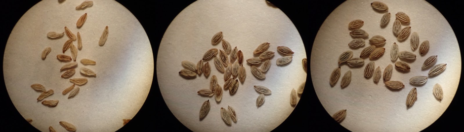
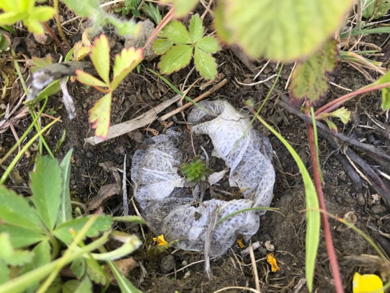

\newpage{}

# Horticultural protocols for experimental studies of eyebrights (*Euphrasia*, Orobanchaceae)

## Introduction

Parasitic plants are a diverse group of 4,500 species that are defined by possessing a parasitic feeding organ called a haustorium that can attach and steal nutrients from a host plant [@RN1537]. Some of the most familiar parasitic plants include the crop pest witchweed (*Striga*, Orobanchaceae), mistletoes such as *Viscum album* (Santalaceae), the common grassland wildflower yellow rattle (*Rhinanthus*, Orobanchaceae), and the species possessing the largest flower in nature, *Rafflesia arnoldii* [Rafflesiaceae; @RN1140]. The diversity of parasitic plants, with parasitism described from 12 plant families [@RN1100], is matched by the diversity of growing conditions necessary to succeed in cultivating these plants. Even related parasitic plant species can be found in contrasting conditions and it is important that these are matched in cultivation [e.g. the Orobanchaceae; @RN842]. There are also a number of specific horticultural issues associated with growing parasitic plants that must be overcome [e.g. germination stimulants @Yoneyamaetal2010a and host specificity @RN1557], though a wide variety of parasitic plants have been and continue to be cultivated [@RN1556]. Parasitic plants are a particular challenge for cultivation as they require conditions suitable for the parasite, the host, and their interaction. Many parasites require host-specific cues in order to germinate, and in many cases the parasite must be added at an appropriate time for the parasite to establish [e.g. @Yoder1999a].

In this article, we describe our experience of optimising horticultural protocols for eyebrights (*Euphrasia*, Orobanchaceae). The genus *Euphrasia* contains approximately 263 species (Daniel Nickrent, pers. comms.) distributed throughout temperate areas of the northern and southern hemisphere, and in montane regions of tropical South East Asia [@RN391]. It includes both perennial and annual species [e.g. @Yeo1973a]. *Euphrasia* are generalist hemiparasites, meaning they are photosynthetically competent and can grow without a host, but perform much better when grown with one of many potential hosts [grasses, forbs, legumes; @RN867]. We are currently developing British *Euphrasia* as a study system for understanding plant parasitism, and for investigating evolutionary questions related to hybridisation, polyploidy, and self-fertilisation. There are 21 British native species and these show rich variation in habitat, associated species, ploidy [there are diploids and tetraploids; @RN423] and mating system [there are selfing and outcrossing species; @RN375; @RN1156]. They are known to hybridise extensively in the field and produce a diverse array of local hybrids as well as stable hybrid species [@RN287; @RN1156]. Here, we focus on protocols for experimental studies under laboratory conditions, in pot trials, and under field conditions.

## General considerations for cultivating *Euphrasia*

Most experimental work on plants focuses on species that are simple to grow, are small in size at maturity, and rapidly complete their life cycle, such as the thale-cress *Arabidopsis thaliana*, which is a widely used model system [@Weinkoopetal2010]. While British native *Euphrasia* are also small annuals, their cultivation is made difficult due to specific germination requirements and the need for a host. Firstly, *Euphrasia* species require a period of cold before they are able to germinate [@LiebstandSchneller2008a]. In cultivation, seeds therefore need to be stratified. In our experimental work we have achieved this in two ways: leaving seeds outside over winter, and forcing germination through placing seeds in the fridge. Other than requiring stratification, *Euphrasia* species require no special methods for germination, with wild collected seeds planted without removing abortive seeds usually giving 40-50% germination success (chapters 6 and 7). The probability of germination depends on the condition of the seed. In a seed quality experiment in February 2019, we sowed 20 seeds of *E. arctica* from each of three categories (shrivelled, intermediate, and plump, see Figure \ref{CH5F1}) onto moist soil in seed trays that were kept in cold frames. The seeds had been collected in September of the preceding year, kept dry, and stored at 4°C overwinter. Germination differed between categories. By mid-June none of the shrivelled seeds had germinated, but six intermediate ones, and ten plump ones. It is likely that the shrivelled seeds have been aborted by the parental plant, either because of developmental problems, genetic abnormalities, or limited resources [@Stephenson1981a]. 

{ width=100% }

Additionally, *Euphrasia* species require a host for acceptable growth and this requirement must be met within a few days of germination to ensure growth is not hindered [@RN425]. In pots, a host can be transplanted carefully with minimal mortality, otherwise *Euphrasia* can be sown with host seed at the same time. Sowing *Euphrasia* into pre-existing vegetation is possible, however *Euphrasia* is a poor competitor and the vegetation must be sufficiently low or sparse for successful establishment. *Euphrasia* seeds can be stored by routine drying (e.g. at room temperature for one week) and then refrigerating or freezing, with frozen seeds surviving for at least three years [@Chapmanetal2019a]. 

## Laboratory conditions

For detailed studies of plant development, it is necessary to grow plants under controlled laboratory conditions. *Euphrasia* seeds will readily germinate on moist filter paper under sterile conditions. Ethanol should be used to sterilise the plates and seeds, then the filter paper placed inside with the seeds on top. The lid should then be placed on top and the plate sealed to avoid contamination. Seeds should be maintained in a fridge at ~4°C until germination (no supplemental light required). We have tested two seed collections this way, an unidentified diploid species sourced from Wales by commercial supplier Emorsgate, and tetraploid *E. arctica* wild-collected from Inverkeithing in Scotland. Only the second genotype germinated, after six weeks. This method is suitable for growing young seedlings, such as those required for cytology, but further refinement is necessary to make this suitable for growing plants to a larger growth stage. For more detailed developmental studies and for genetic manipulation (such as virus-induced gene silencing) plants can be grown on sterilised plates. Seeds will germinate after ~10 days at 4°C on 1/4 Hoagland media, a widely used hydroponic nutrient solution used in other parasitic plant research [@Delavaultetal1998a]. 

## Pot trials

Growing *Euphrasia* in pots has the benefit of plants being in a soil-like substrate where they can form more natural host interactions than in the laboratory. Such conditions are preferred when studying differences between species, because less natural conditions used in the lab may trigger growth that is not normally observed. When different species are grown under common conditions, phenotypic differences between individuals and between species have to be due to genetic differences [e.g. @Riihimakietal2004a]. Reduced differentiation under common conditions relative to the wild, however, shows that the phenotypic differences observed in nature were mainly due to environmental differences. This is the basis for common garden experiments, which have been extensively used in ecology, evolution and genetics to understand ‘nature vs nurture’.

We have performed four experimental common garden studies with *Euphrasia* plants grown in pots. Our initial experiment took place in a glasshouse at the nursery at RBGE in 2016, and aimed to study the different growth patterns of five different *Euphrasia* species (and multiple hybrids), and individuals of *E. arctica* grown on eight different hosts (and without a host; see chapter 6). We found that host species impacted on the phenotype of *E. arctica* for some traits (e.g. height) but not for others (e.g. nodes to flower) and that certain *Euphrasia* species overlapped in many traits (e.g. *E. arctica*/*confusa*/*nemorosa*), while others were relatively distinct (e.g. *E. micrantha*). While successful, the most notable challenge was the relatively high mortality of individuals, and issues with high temperatures under glass on hot summer days which caused flower buds to abort. In the second and third experiments (see chapter 7), which took place over two years (2017/18), used a new, better-ventilated and climatically controlled glasshouse for the *Euphrasia* post germination. In the first year, we measured the same species, *E. arctica*, but this time on 45 different hosts, and found that survival and fitness varies greatly between *Euphrasia* on different host species. In the second year, we measured fitness across four different *Euphrasia* species on thirteen different hosts, which revealed host-parasite interactions in specific *Euphrasia*-host combinations. The fourth experiment [@RN1413] looked to investigate different morphologies of three tetraploid *Euphrasia* species collected from Fair Isle [*E. arctica*, *E. foulaensis*, and *E. micrantha*; @RN1413]. 

The Fair Isle experiment used seeds from two populations of each of the three *Euphrasia* species, grown with twelve host species, including wild-collected heather (*Calluna vulgaris*) and juniper (*Juniperus communis*) from Fair Isle. This experiment was performed in an outside seed frame (seen in Figure \ref{CH5F2}a), which is a well-ventilated structure that protects from damage by animals or wind. While there are benefits to growing plants outside (such as less-vigorous growth more similar to that seen in the wild), these plants grew relatively poorly, due to the partial shade of the side of the seed frames. We also found the soil mix, RBGE 1, has a tendency to become waterlogged, which creates problems after heavy or extended wet periods, but can also dry out rapidly in hot weather. This was less of a problem in the glasshouse where watering can be more easily controlled.

Each of these four experiments followed a similar protocol. All experiments aimed for at least 30 pots of each population-host combination and allowed for approximately 50% germination success. A single seed is planted in the centre of the pot, with this placement helping to identify it from any contaminant weed seeds. Planting pots of 9x9x9.5 cm are filled with a loose bark-based substrate (RGBE1). After sowing plants are lightly top dressed with sieved soil, and the pots moved to a seed frame where they remained until germination (Figure \ref{CH5F2}a). Host seeds are sown into trays with RGBE1 in February and introduced after the *Euphrasia* germinates.

{ width=100% }

Proper introduction of a host plant is critical in the establishment of a connection between *Euphrasia* and the host. We developed a protocol where the *Euphrasia* did not have to be transplanted, as early trials indicated this resulted in high mortality. Instead, we transplant young host plants (< 2 weeks post germination) into a pot containing a *Euphrasia* individual in the centre (Figure \ref{CH5F2}b). The transplanted individual is placed equidistant between the *Euphrasia* individual and one of the four corners of the pot. In common garden trials with many plants, this allows us to keep a consistent distance between the *Euphrasia* and the host plant so there is no effect of distance to host. Placing a host too close to the *Euphrasia* could lead to either very early attachment (beneficial) or high levels of competition (detrimental), and vice versa.

In April, each germinant pot received one host plant, the survival of which was generally high. Plants are then moved to their final growing conditions (the glasshouse, or outside; Figure \ref{CH5F2}c). During the course of the summer, host plants had to be trimmed to avoid shading of neighbouring pots. Pots were randomised monthly to minimse block effects (e.g. plants on one bench growing better than others). Every day, plants were checked to measure traits on the day of first flowering, which represented a standardised time point to measure traits between individuals for use in statistical analyses.

Watering is necessary to prevent pots drying out. We have watered when required rather than as a matter of routine. We have found watering by hand to be more reliable for experimental work than automated irrigation, which can be patchy and may lead to uneven growth. *Euphrasia* favours drier over damper growing conditions, although this sometimes resulted in sub-optimal conditions for the hosts.

Supplementary feeding has proven necessary for vigorous *Euphrasia* growth in small pots. Our feeding regime begins in May before the transplantation of hosts had been completed. When *Euphrasia* flower, feeding is increased from fortnightly to weekly. Liquid feed was diluted at 1.5% by a Dosatron when watering with a fine rose. While the vigour of some of the hosts visibly improved after feeding, there seemed to be less of a direct correlation between feeding and increased *Euphrasia* vigour. 

In addition to the previously mentioned trimming of the hosts, the pots were regularly weeded. Special attention must be paid at the start of the process, before *Euphrasia* seeds have apparently germinated, so that a *Euphrasia* individual does not begin to parasitise a weed. Moss and liverworts also need to be periodically removed when they threaten to smother the *Euphrasia*. Great care has to be taken to not disturb the roots of either the *Euphrasia* or host when weeding, therefore all weeding is best done with a pair of tweezers. 

There are a few species of pest which attack *Euphrasia* in cultivation. The most serious pests are aphids (Aphididae), which attack the upper stem and leaves. In heavy infestations, leaves can fall off the plant, and in some cases aphid damage can be fatal. The effect of aphids can be alleviated by spraying a soapy solution on the plants to suffocate the aphids, or if *Euphrasia* individuals are kept in glasshouses, to keep air movement and ventilation. Another common pest is a species of rust [*Coleosporium*; likely alternate host of pine; @EllisandEllis1985a], which although an alarming orange colour, has an unknown effect on *Euphrasia*. Lastly, some caterpillar species in the Lepidopteran genus *Perizoma* attack *Euphrasia* by spinning and eating the leaves [@RN1511].

As *Euphrasia* are annual plants, all individuals die at the end of the season, which may last until late September. After germination, if a *Euphrasia* individual is unable to find a host then it either remains small in stature for months before dying, or dies quickly - usually within two weeks. Host species can influence survival of *Euphrasia* dramatically. Fast growing hosts which *Euphrasia* cannot attach to compete with the *Euphrasia* seedling for light, and increase the probability of *Euphrasia* mortality. In general, leguminous or grass host species confer higher probabilities of survival for *Euphrasia* than forbs or woody plants.

## Field trials

Yellow rattle (*Rhinanthus minor*) has widely been exploited in meadows for its properties of parasitising and reducing the vigour of surrounding plants, thus reducing the need for mowing and for maintenance [@westbury2007impact; @ameloot2005meta]. *Euphrasia*, as a related hemiparasite, could be used for similar purposes, with the wide-range of habitats of different *Euphrasia* species making it potentially useful in habitats where *Rhinanthus* does not survive. To produce seeds for large-scale planting requires *Euphrasia* to be cultivated on a field scale. In a collaboration with Scotia Seeds (http://www.scotiaseeds.co.uk/) we set up some field plots with a view to understand how feasible it would be to cultivate *Euphrasia* at scale. In late October 2018, a 200m^2^ plot was cleared to allow the sowing of host and *Euphrasia* species, with 24 2m^2^ plots used for planting. Two different populations of *Euphrasia* arctica were trialled, one from North Berwick collected in 2016 and one from Inverkeithing collected in 2017. Sowing densities for *Euphrasia* were at 500 seeds per square metre (0.625g) and host densities were around 2g per metre square. We used four different host treatments in combination with *Euphrasia*: *Lotus corniculatus*, *Cynosurus cristatus*, *Plantago lanceolata* and Mavisbank Meadow Mix (see details of mix on website: (https://www.scotiaseeds.co.uk/shop/mavisbank-mix/). In early September 2019 the mature plants were hand collected from each plot. Ten random individuals from each plot were sampled in order to determine vigour of the *Euphrasia* plants in each plot. 

{ width=100% }

Preliminary results indicate that cultivation of *Euphrasia* arctica on a field scale yields vigorous plants in excess of 20cm in height (Figure \ref{CH5F3}). From experimental data from pot trials, which used the same species of *Euphrasia*, plants around 20cm tall produced ~150 reproductive nodes and therefore around 1800 seeds (extrapolated from models in chapter 7, and assuming six seeds per capsule). For harvesting efficiency it is recommended that either *L. corniculatus* or *P. lanceolata* is used as grass species cause *Euphrasia* to form flexuous stem bases, which are difficult to harvest. *Euphrasia* arctica therefore could be managed on a field scale and give suitable yields for Scotia Seeds. 

## Reciprocal transplant experiments

While the protocols outlined above emulate aspects of natural conditions, planting *Euphrasia* in the wild is the ‘gold standard’ for experimental studies as it is the only way to include all biotic and abiotic stressors found in nature. Reciprocal transplant experiments involve translocating individuals between natural environments, and can be used to distinguish between genetic and environmental effects. If after the transplant, each transplanted sample shows the same traits as at their ‘home’ site, it can be assumed that the trait differences have a genetic base. If on the contrary, the growing site determines some trait of interest, then the plants react plastically to their environment, and their genes do not determine the trait in question. It may well be that the result of a reciprocal transplant experiment is intermediate – many traits are affected by both genetic and environmental factors. Reciprocal transplants are particularly useful for investigating local adaptation, such as whether plants produce more seeds in their home site. 

Conducting a transplant with hemiparasitic *Euphrasia* bears unique challenges. It is well-established now that the performance of *Euphrasia* plants depends critically on whether there are host plants available, which species they are, and on the timing of haustorium attachment. This means that, unlike in other large transplant experiments, clearing the local vegetation is not an option. We have therefore tested two approaches to transplants in *Euphrasia*.

To test the suitability of different substrates and planting containers, a preliminary field trail was carried out near Inverkeithing, Scotland, in 2018. We buried in the ground compostable plant pots (filled with local soil) and inflated “Jiffy” peat pellets (Figure 4). In each, we placed one *Euphrasia* seed. On our next visit, approximately four months later, we found that the compostable pots had persisted virtually unchanged and the outer mesh of the “Jiffy” pellets had not decomposed. Some pellets had lost their mesh, which we found in the nearby vegetation. While the surrounding vegetation was in good condition, our planting containers appeared dry and we recorded hardly any germination. 2018 was a very dry year, which may have affected the decomposition process, but the materials tested did not seem appropriate to be used in the wild in larger experiments.

{ width=100% }

On our second attempt, this time in field sites on Fair Isle, we decided to make planting holes and to fill them with sterile substrate. We used commercial compost (John Innes). Small planting holes were filled with the sterile compost in order to exclude local plants. These holes are small enough for surrounding plants to root through them in a short time, but they reduced the possibility of a local *Euphrasia* seeding directly onto the planting spot. Planting was carried out in mid-September. Sites were chosen in three habitat types: heathland, coastal turf, and grassland. Woody vegetation, chiefly *Calluna vulgaris* and *Empetrum nigrum*, was cut back to allow access to the ground. Planting holes were dug with a bulb planter with the planting holes arranged in grids for ease of recoverability. Each hole was filled with compost to soil level. A single *Euphrasia* seed was then placed in the centre of each circular compost patch and a light top dressing of composts was applied. Each planting hole was individually labelled with a pencil-marked plastic tag. The label positions were recorded so that finding one label allowed to locate all other planting holes in a grid. Each label was sunk into the ground completely. While in many respects this type of experiment under wild conditions provides the most natural settings, it comes with extensive challenges. The ease of digging into substrate depended on the location; heather bog was especially challenging to produce neat holes to sow *Euphrasia* into. Sowing is also very difficult in windy conditions, even with the help of tweezers. Finding the holes months later required good mapped locations of each grid, as some were remarkably well hidden. Some birds also removed the labels and sheep were liable to trample on the holes made, both of which resulted in missing data. One of the biggest challenges was the low percent germination, which although observed in common garden experiments, is even lower in the wild. Despite these challenges, it is still possible to carry out these kinds of experiments in natural settings.

## Conclusions and future directions

The genus *Euphrasia* represents an excellent study system to investigate a wide variety of topics, from the evolution of parasitism, to the role of polyploidy, hybridisation, and mating system in taxonomic complexity. *Euphrasia* can easily be brought into cultivation in petri dishes, and in pots, both in the glasshouse and outside. In addition, *Euphrasia* can be grown on many different species of host plant, making it an ideal system to investigate host effects on *Euphrasia* and vice versa. Field trials have been met with success on a commercial scale, however reciprocal transplant experiments in the wild are difficult and require many thousands of replicates for statistically robust inference. 

There are many possibilities for future research building on these protocols. The laboratory protocols for fine scale developmental, genetic and host-parasite interface work should be developed to understand the nature of haustoria formation in *Euphrasia* on different host plants [as has been done in *Rhinanthus* @rumer2007anatomical]. Further, transcriptome sequencing of haustoria may reveal the genes underlying parasitism in *Euphrasia* [@yang2015comparative]. Investigation of below ground host-*Euphrasia* interactions in pots will open up an area of research into the number of haustorial connections made to host plants, and may reveal host preferences. Further large scale reciprocal transplant experiments should be made to understand host preferences and the extent of  local adaptation in the genus. 
